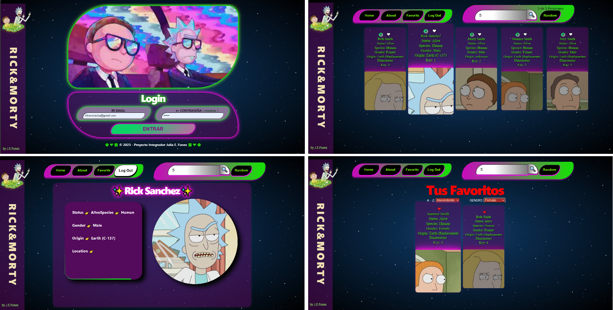

# RickandMorty

<h1> Proyecto Integrador Henry: </h1>

<h2> Módulo II </h2>
 
 Implementamos todo lo aprendido en este módulo: 

 <ul>
  <li>React:
      <ul>
      <li> Intro </li>
      <li> Estilos </li>
      <li> Estados, LifeCycling </li>
      <li> Rooting </li>
      <li> Forms </li>
      </ul>
      </li>
      
  <li>React + Redux, </li>
  <li>React + Redux + Hooks, </li>
  <li>CSS </li>
  </ul>

  <h2> Módulo III </h2>
  
 Llevamos implementando hasta el momento:

  <ul>
  <li>Node.js</li>
  <li>Web Server</li>
</ul>